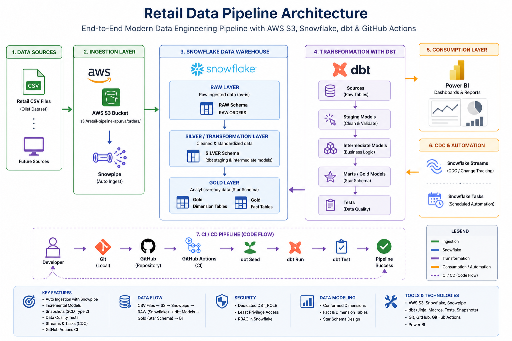
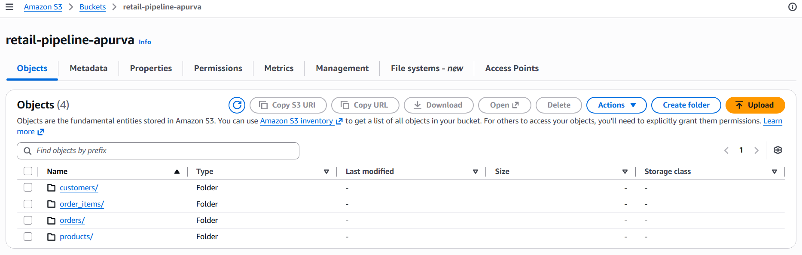
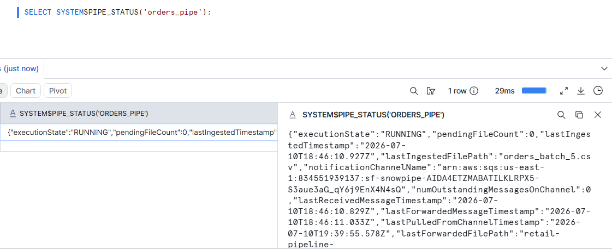
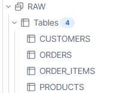
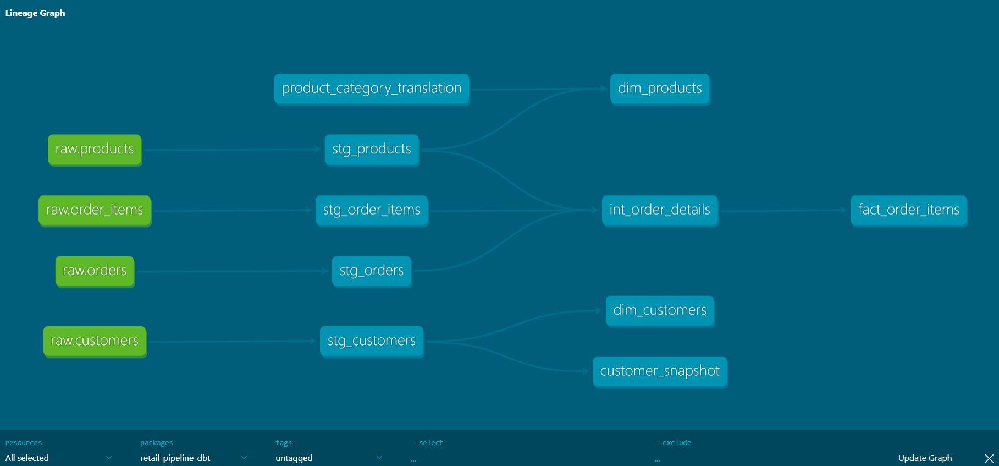
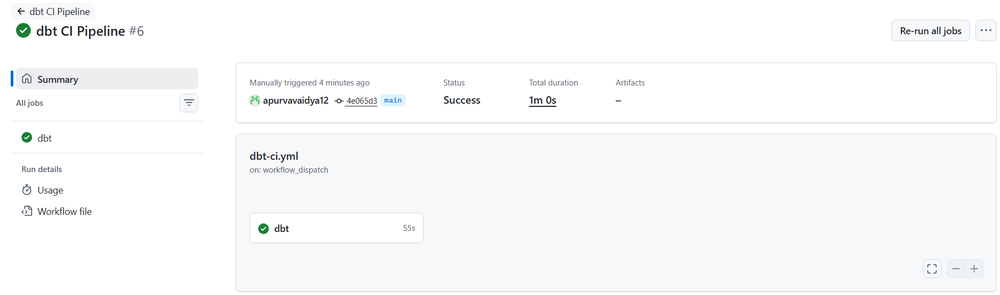
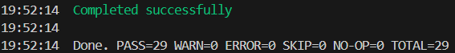
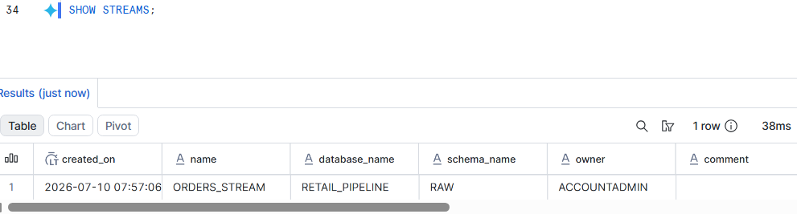
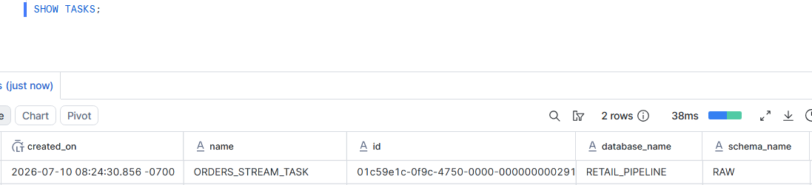
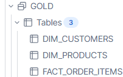

# 🚀 End-to-End Modern Data Engineering Pipeline with AWS S3, Snowflake & dbt

## 📌 Project Overview

This project demonstrates the design and implementation of a modern end-to-end data engineering pipeline using **AWS S3**, **Snowflake**, **dbt**, and **GitHub Actions**. The pipeline automates data ingestion, transformation, testing, and deployment while following industry best practices such as layered data architecture, version control, CI/CD, incremental processing, and role-based security.

The project uses the **Brazilian E-Commerce (Olist)** dataset to simulate a real-world retail analytics platform. Raw CSV files are stored in AWS S3 and automatically ingested into Snowflake using **Snowpipe**. Data is transformed through a multi-layer dbt architecture into analytics-ready dimension and fact tables that can be consumed by reporting tools such as Power BI.

Throughout the project, several production-oriented concepts have been implemented, including incremental models, snapshots (SCD Type 2), data quality testing, macros, Snowflake Streams, Tasks, GitHub-based version control, and automated CI validation using GitHub Actions.

---

## ⭐ Project Highlights

* End-to-end cloud data pipeline using AWS S3, Snowflake, dbt, and GitHub Actions
* Automated file ingestion using Snowpipe
* Layered data warehouse architecture (RAW → SILVER → GOLD)
* Star schema design with fact and dimension tables
* Incremental data loading using dbt Incremental Models
* Slowly Changing Dimension (SCD Type 2) implementation using dbt Snapshots
* Data quality validation using dbt Generic Tests and Custom Tests
* Reusable SQL logic using dbt Macros
* Demonstration of Change Data Capture (CDC) using Snowflake Streams
* Task automation concepts using Snowflake Tasks
* Role-Based Access Control (RBAC) using a dedicated `DBT_ROLE`
* Version control with Git and GitHub
* Continuous Integration (CI) using GitHub Actions for automated dbt validation


## ✅ Implementation Status

| Feature                               | Status |
| ------------------------------------- | :----: |
| AWS S3 Data Lake                      |    ✅   |
| Snowflake Data Warehouse              |    ✅   |
| External Stages                       |    ✅   |
| CSV File Formats                      |    ✅   |
| Snowpipe Auto-Ingest                  |    ✅   |
| RAW → SILVER → GOLD Architecture      |    ✅   |
| dbt Staging Models                    |    ✅   |
| dbt Intermediate Models               |    ✅   |
| Star Schema (Fact & Dimension Tables) |    ✅   |
| Incremental Models                    |    ✅   |
| dbt Snapshots (SCD Type 2)            |    ✅   |
| dbt Generic Tests                     |    ✅   |
| dbt Seeds                             |    ✅   |
| dbt Macros                            |    ✅   |
| Snowflake Streams (CDC)               |    ✅   |
| Snowflake Tasks                       |    ✅   |
| Role-Based Access Control (RBAC)      |    ✅   |
| Git Version Control                   |    ✅   |
| GitHub Actions (CI)                   |    ✅   |
| End-to-End Pipeline Validation        |    ✅   |

# 🧪 End-to-End Validation Performed

To verify that every component of the pipeline behaved as expected, multiple validation scenarios were executed throughout the project.

| Validation Scenario                                                         |  Result  |
| --------------------------------------------------------------------------- | :------: |
| Snowpipe automatically ingests newly uploaded files from AWS S3             | ✅ Passed |
| RAW layer receives only newly uploaded batches                              | ✅ Passed |
| Incremental dbt model processes only new records on subsequent runs         | ✅ Passed |
| Re-running incremental models without new data inserts zero additional rows | ✅ Passed |
| Snapshot correctly maintains historical customer records (SCD Type 2)       | ✅ Passed |
| Snowflake Streams capture unconsumed data changes                           | ✅ Passed |
| Snowflake Tasks execute successfully for automation demonstrations          | ✅ Passed |
| GitHub Actions automatically triggers after every push to the `main` branch | ✅ Passed |
| dbt models execute successfully within the CI pipeline                      | ✅ Passed |
| dbt Generic Tests complete successfully without errors                      | ✅ Passed |
| Gold layer tables update correctly after new data ingestion                 | ✅ Passed |

---

## 📸 Project Screenshots

### Architecture Overview



---

### AWS S3 Bucket Structure



---

### Snowpipe Auto-Ingest



---

### RAW Layer Tables



---

### dbt Lineage Graph



---

### GitHub Actions CI Pipeline



---

### dbt Test Results



---

### Snowflake Streams



---

### Snowflake Tasks



---

### Gold Layer Tables



---

## 🎯 Business Objective

Retail organizations receive new transactional data continuously. To generate reliable business insights, this data must be ingested, validated, transformed, and modeled into an analytics-ready format.

The objective of this project is to build a scalable and maintainable data pipeline that:

* Automatically ingests new data files from AWS S3 into Snowflake.
* Cleans and standardizes raw datasets.
* Builds analytics-ready dimension and fact tables using dbt.
* Applies data quality checks before data is consumed.
* Supports incremental data processing for improved efficiency.
* Demonstrates modern DevOps practices using GitHub Actions.

The resulting Gold layer can be connected directly to BI tools such as Power BI for reporting and dashboarding.

## 🛠️ Technology Stack

| Category                   | Technology                      |
| -------------------------- | ------------------------------- |
| Cloud Storage              | AWS S3                          |
| Cloud Data Warehouse       | Snowflake                       |
| Data Transformation        | dbt (Data Build Tool)           |
| Programming Language       | SQL, Jinja                      |
| Version Control            | Git                             |
| Repository Hosting         | GitHub                          |
| CI                         | GitHub Actions                  |
| Data Ingestion             | Snowpipe (Auto Ingest)          |
| Change Data Capture        | Snowflake Streams               |
| Task Automation            | Snowflake Tasks                 |
| Data Modeling              | Star Schema                     |
| Data Quality               | dbt Generic Tests, Custom Tests |
| Slowly Changing Dimensions | dbt Snapshots (SCD Type 2)      |
| Incremental Processing     | dbt Incremental Models          |
| Security                   | Snowflake RBAC                  |
| BI Tool (Optional)         | Power BI                        |

---

# 📂 Dataset

This project uses the **Brazilian E-Commerce Public Dataset by Olist**, one of the most widely used datasets for learning modern data engineering and analytics.

The dataset represents a real-world retail business and contains information related to:

* Customers
* Orders
* Order Items
* Products
* Sellers
* Payments
* Reviews
* Geolocation

For this project, a subset of the dataset was selected to build a realistic end-to-end pipeline while keeping the implementation focused on Snowflake and dbt concepts.

### Tables Used

| Table                        | Purpose                                     |
| ---------------------------- | ------------------------------------------- |
| Customers                    | Customer master data                        |
| Orders                       | Order lifecycle and timestamps              |
| Order Items                  | Transaction-level sales data                |
| Products                     | Product master information                  |
| Product Category Translation | Seed data used for English category mapping |

---

# 📁 Project Structure

```text
retail_pipeline_dbt/
│
├── .github/
│   └── workflows/
│       └── dbt-ci.yml                 # GitHub Actions CI workflow
│
├── models/
│   ├── staging/
│   ├── intermediate/
│   └── marts/
│       ├── dimensions/
│       └── facts/
│
├── macros/                            # Reusable dbt macros
│
├── snapshots/                         # SCD Type 2 snapshots
│
├── seeds/                             # Reference CSV files
│
├── tests/                             # Generic & custom dbt tests
│
├── Snowflake_sql/                     # Snowflake SQL scripts
│
├── architecture/                      # Architecture diagrams & screenshots
│
├── dbt_project.yml
├── packages.yml
├── README.md
└── .gitignore
```

---

# 🗂️ Data Warehouse Architecture

The project follows a layered Medallion-style architecture.

## 🥉 RAW Layer (Bronze)

* Stores data exactly as received from AWS S3.
* Loaded automatically using Snowpipe.
* No business transformations are applied.
* Acts as the source of truth.

---

## 🥈 SILVER Layer

* Implemented using dbt Staging and Intermediate models.
* Performs:

  * Data cleaning
  * Data standardization
  * Column renaming
  * Business logic
  * Data enrichment

---

## 🥇 GOLD Layer

The Gold layer contains analytics-ready tables designed using a Star Schema.

### Dimension Tables

* Dim Customers
* Dim Products

### Fact Tables

* Fact Order Items

These tables are optimized for reporting and can be directly consumed by BI tools such as Power BI.


# ⚙️ Pipeline Implementation

This project was built incrementally to simulate a real-world data engineering workflow. Each component was introduced to solve a specific problem within the pipeline.

---

# 📥 1. Data Ingestion using Snowpipe

Raw CSV files are stored in AWS S3 and automatically ingested into Snowflake using **Snowpipe Auto-Ingest**.

### Workflow

```text
CSV Files
     │
     ▼
 AWS S3 Bucket
     │
(Event Notification)
     │
     ▼
Snowpipe
     │
     ▼
RAW Schema
```

### Key Features

* Automatic ingestion of newly uploaded files
* Near real-time loading
* No manual COPY commands required after setup
* Event-driven architecture using AWS S3 notifications

---

# 📂 2. External Stage & File Formats

Snowflake External Stages were configured to read data directly from AWS S3.

A reusable CSV File Format object was created to standardize:

* Header handling
* Null values
* Text enclosure
* Compression settings

This allows multiple datasets to share the same ingestion configuration.

---

# 🥉 3. RAW Layer

The RAW layer stores source data exactly as received from AWS S3.

Characteristics:

* No transformations
* Original schema preserved
* Source of truth
* Loaded automatically through Snowpipe

Tables include:

* Orders
* Customers
* Products
* Order Items

---

# 🥈 4. SILVER Layer (dbt Staging & Intermediate)

The Silver layer is implemented using dbt.

Responsibilities include:

* Standardizing column names
* Type conversions
* Removing unnecessary columns
* Business logic implementation
* Preparing data for analytics

The objective is to keep business rules centralized and reusable.

---

# 🥇 5. GOLD Layer

The Gold layer follows a Star Schema design.

### Dimension Tables

* dim_customers
* dim_products

### Fact Table

* fact_order_items

These tables are optimized for reporting and analytical queries.

---

# ⚡ 6. Incremental Models

The Fact table is implemented as a dbt Incremental Model.

Instead of rebuilding the complete table during every execution, only newly arrived records are processed.

Benefits:

* Faster execution
* Lower compute cost
* Better scalability
* Production-ready design

The incremental logic uses the latest `order_purchase_timestamp` to identify newly arrived orders.

---

# 🕒 7. Slowly Changing Dimensions (SCD Type 2)

Customer data is tracked using dbt Snapshots.

Whenever monitored customer attributes change, dbt automatically:

* Preserves historical records
* Creates a new version
* Tracks validity periods

This enables historical reporting and auditability.

---

# 🔄 8. Change Data Capture (CDC)

Snowflake Streams were implemented to demonstrate Change Data Capture.

Streams track inserts, updates, and deletes occurring in source tables without duplicating data.

This project uses Streams to understand native CDC capabilities within Snowflake.

---

# ⏰ 9. Snowflake Tasks

Snowflake Tasks were created to demonstrate automated SQL execution.

Although dbt performs the primary transformations in this project, Tasks illustrate how production pipelines can execute SQL automatically based on schedules or events.

---

# 🧪 10. Data Quality Testing

Data quality checks are implemented using dbt Generic Tests.

Examples include:

* Unique
* Not Null
* Accepted Values
* Relationships

These tests ensure that only high-quality data reaches the analytics layer.

---

# 🌱 11. Seed Files

dbt Seeds were used to load reference data into Snowflake.

The Product Category Translation dataset is loaded automatically and joined during transformations to provide English category names.

---

# 🔁 12. Reusable Macros

Custom dbt Macros were created to eliminate repetitive SQL logic.

This improves:

* Maintainability
* Reusability
* Code readability

Macros allow common logic to be reused across multiple dbt models.

---

# 🔐 13. Security

A dedicated Snowflake role (`DBT_ROLE`) was created following the principle of least privilege.

Privileges were granted only on the required:

* Warehouse
* Database
* Schemas
* Tables

This demonstrates basic Role-Based Access Control (RBAC) implementation within Snowflake.

---

# 🚀 14. Continuous Integration (CI)

The project integrates GitHub Actions to automatically validate the dbt project whenever changes are pushed to the repository.

The workflow performs:

* Repository checkout
* Python environment setup
* dbt dependency installation
* `dbt seed
* `dbt run
* `dbt test

This ensures that every code change is validated before being merged into the main branch.

# 🚀 Project Journey

The project was developed incrementally, with each phase introducing a new concept commonly used in modern data engineering.

| Phase    | Implementation                                                       |
| -------- | -------------------------------------------------------------------- |
| Phase 1  | Created Snowflake Warehouse, Database, and Schemas                   |
| Phase 2  | Configured AWS S3 and External Stage for data ingestion              |
| Phase 3  | Loaded raw retail datasets into Snowflake                            |
| Phase 4  | Automated data ingestion using Snowpipe Auto-Ingest                  |
| Phase 5  | Built staging, intermediate, and Gold models using dbt               |
| Phase 6  | Implemented dbt Seeds, Macros, Generic Tests, and Snapshots          |
| Phase 7  | Optimized Fact tables using Incremental Models                       |
| Phase 8  | Implemented Snowflake Streams and Tasks for CDC demonstration        |
| Phase 9  | Configured GitHub Actions for Continuous Integration                 |
| Phase 10 | Validated the complete end-to-end pipeline from AWS S3 to Gold layer |

---

# ▶️ How to Run the Project

## 1. Clone the Repository

```bash
git clone https://github.com/<your-username>/retail-pipeline-dbt.git
cd retail-pipeline-dbt
```

---

## 2. Create and Activate a Python Virtual Environment

```bash
python -m venv .venv
```

Windows:

```bash
.venv\Scripts\activate
```

Linux / macOS:

```bash
source .venv/bin/activate
```

---

## 3. Install dbt

```bash
pip install dbt-snowflake
```

---

## 4. Configure Snowflake Profile

Create or update your `profiles.yml` file with your Snowflake account credentials.

Update the following values:

* Account
* Username
* Password
* Warehouse
* Database
* Schema
* Role

---

## 5. Install Project Dependencies

```bash
dbt deps
```

---

## 6. Load Seed Data

```bash
dbt seed
```

---

## 7. Execute Models

```bash
dbt run
```

---

## 8. Run Data Quality Tests

```bash
dbt test
```

---

## 9. Generate Documentation

```bash
dbt docs generate
```

Serve the documentation locally:

```bash
dbt docs serve
```

---

# 📊 Key Features Demonstrated

✅ AWS S3 Data Lake Integration

✅ Snowflake Cloud Data Warehouse

✅ Snowpipe Auto-Ingest

✅ External Stages

✅ File Formats

✅ Layered Data Architecture

✅ dbt Staging Models

✅ Intermediate Models

✅ Fact & Dimension Modeling

✅ Incremental Processing

✅ Snapshots (SCD Type 2)

✅ Generic Data Quality Tests

✅ Custom Macros

✅ Seed Files

✅ Snowflake Streams

✅ Snowflake Tasks

✅ Git Version Control

✅ GitHub Actions (CI)

✅ End-to-End Pipeline Validation

---

# 🔮 Future Improvements

Potential enhancements include:

* Replace AWS Access Keys with Snowflake Storage Integration for production-grade authentication.
* Automate dbt execution after Snowpipe ingestion using an orchestration tool such as Apache Airflow or AWS Lambda.
* Extend the Gold layer with additional business marts (Sales, Payments, Reviews, Sellers).
* Implement Slowly Changing Dimensions for additional entities.
* Introduce environment-specific deployments (Development, QA, Production).
* Integrate Power BI dashboards directly with the Gold layer.
* Add monitoring, alerting, and data observability capabilities.

---

# 📚 Key Learning Outcomes

This project provided hands-on experience with modern cloud data engineering concepts, including:

* Designing layered data warehouse architectures.
* Building scalable ELT pipelines using Snowflake and dbt.
* Automating ingestion with Snowpipe.
* Implementing incremental transformations and historical tracking.
* Applying data quality validation using dbt.
* Understanding Change Data Capture (CDC) with Snowflake Streams.
* Automating SQL execution using Snowflake Tasks.
* Managing code using Git and GitHub.
* Implementing Continuous Integration using GitHub Actions.
* Validating complete end-to-end data pipelines from cloud storage to analytics-ready datasets.

---

# 👨‍💻 Author

**Apurva Vaidya**

If you found this project useful or have suggestions for improvement, feel free to open an issue or submit a pull request.
